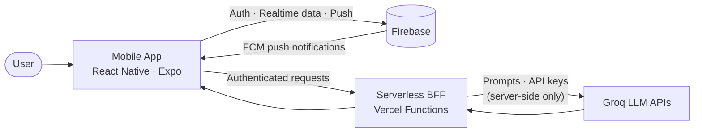

# Serin
### GenAI-Powered Smart Gifting & Event Assistant

*Never miss a special moment. Make every one unforgettable.*

 

 

> **About this repository.** Serin's source code is private. This repository is a **product and engineering showcase**: what I built, why I made each design decision, and how the system works. I'm happy to walk through the code live in an interview.

<b>🇹🇷 Türkçe Özet</b>

**Serin**, hediye seçmeyi, özel günleri takip etmeyi ve sevdiklerini şaşırtmayı yapay zekâ ile birleştiren bir mobil uygulamadır. Fikirden tasarıma, mimariden Google Play yayınına kadar bütün süreci tek başıma yürüttüm: ürün kurgusu, UI/UX tasarımı, el çizimi illüstrasyonlar, React Native geliştirme, sunucusuz (serverless) arka uç, test ve yayın.

Öne çıkanlar: sesle veya yazıyla çalışan akıllı takvim, dijital pasta (sesli not + PIN kilidi), kaydır-beğen hediye keşfi, ortak kasa (grup hediyesi) ve yapay zekâ ile kişiye özel akrostiş şiir. API anahtarları uygulamada hiç bulunmaz, tüm yapay zekâ istekleri Vercel üzerindeki güvenli bir ara katmandan geçer. Ödeme sistemi (Stripe) yerine, PCI-DSS yükümlülüğünü doğurmayan şeffaf bir "Ortak Kasa" mekanizması tasarladım.

---

## At a Glance

| | |
|---|---|
| **Product** | Cross-platform mobile app for gifting and event management, powered by generative AI |
| **Status** | Live on Google Play, published after a 14-day closed test |
| **My role** | Founder · Product design · UI/UX & illustration · Mobile engineering · Serverless backend · Release management |
| **Team** | Solo |
| **Build time** | ~4 months of intensive development, followed by a 14-day closed test |
| **Stack** | React Native (New Architecture) · Expo · Reanimated · Firebase · Vercel Serverless Functions · Groq LLM APIs |

---

## The Problem

People forget birthdays, run out of time, and spend hours wondering what to buy. Group gifts turn into awkward chat threads about who owes what. Generic gift lists ignore who the gift is for, the budget, and the mood.

## The Solution

Serin is a warm, proactive assistant that **remembers for you, suggests for you, and helps you express yourself**:

- Tell it about an upcoming event in plain language; it lands in your calendar with escalating reminders.
- Swipe through gift ideas filtered by recipient, age, budget and mood.
- Pool money with friends for a bigger gift, transparently.
- Send a personal, hand-made feeling surprise: a voice-note digital cake or an AI-written acrostic poem.

---

## Features

### 🧠 Smart Calendar (Natural-Language Commands)
Say or type *"Ayşe's birthday is next month, I've set aside 500 lira"* and Serin turns it into a structured calendar event with the person, date, occasion and budget, then schedules **staged reminders** so you are never late. Push notifications work across **6 distinct event scenarios** via Firebase.

### 🎂 Interactive Digital Cake
A drag-and-drop cake designer: choose toppings (strawberry, cherry, kiwi, orange, blueberry, mint, Oreo, meringue), **draw your own topping**, and attach a **voice note**. Optionally lock it with a **PIN**; the recipient unlocks the surprise at the right moment by **blowing out the candle**.

### 🃏 Discover: Swipe-Based Gift Curation
A card-stack interface with **Pass / Favorite / Like** gestures that updates the user's favorites in the backend in real time. Recommendations are filtered by recipient, age, budget and mood. Built with Reanimated gesture handling and optimized to hold a fluid frame rate while rendering image-heavy cards.

### 🤝 Ortak Kasa (Group Fund)
Set a goal with friends, invite participants, share the IBAN, and let everyone log their contribution. A dynamic **progress bar** and per-person status (*Paid / Pending*) keep the group aligned, with no complicated payment steps. Serin coordinates the contributions; it does not process or hold money.

### ✍️ AI Studio: Personalized Acrostic Poems
Enter a name; the LLM writes an acrostic poem from its letters, rendered on an elegant card that can be downloaded or shared in one tap.

### 🏠 Personalized Dashboard & Profile
Greeting, upcoming-event countdown badges, favorites, quick actions for AI-driven surprises, plus **Dark Mode** and **haptic feedback** settings.

### 🪄 Frictionless Onboarding
No heavy sign-up forms: users enter a name and start, backed by passwordless Firebase authentication. A hand-drawn mascot guides the first-run experience.

---

## System Architecture

**Backend-for-Frontend (BFF) on Vercel.** The app never calls an LLM directly. Every generative-AI request goes through a serverless layer that holds the API keys and the prompt logic, so **secrets are never shipped inside the app bundle**. This also lets me iterate on prompts and models without releasing a new app version.

**Firebase for the real-time and identity layer.** Passwordless authentication, user data, and push notifications across multiple event scenarios.

**Client.** React Native on the New Architecture with Expo; gesture-driven interactions via Reanimated; native haptics.

---

## Key Engineering Decisions

| Decision | Alternatives considered | Why this choice |
|---|---|---|
| **Serverless BFF between app and LLM** | Calling Groq directly from the client | Keeps API keys and prompt logic off the device; central place for validation and future rate limiting |
| **Replace Stripe with "Ortak Kasa"** | Real in-app payments | Handling real card/financial data triggers heavy compliance (PCI-DSS) and risk, which is unrealistic for a solo developer. A transparent coordination mechanism delivers the user value without that liability |
| **Passwordless, low-friction onboarding** | Email/password registration | Lowest possible barrier to first value; fewer credentials to leak or reset |
| **React Native New Architecture + Expo + Reanimated** | Fully native apps, older RN architecture | One codebase, smooth gesture-heavy UI, fast iteration and release |
| **Privacy by design for IBAN data** | Informal handling | IBAN-related data handling is explicitly documented in a published privacy policy |

---

## Engineering Challenges

**1. The PCI-DSS pivot.** I first built a working Stripe flow with test cards. While assessing the legal and security obligations of touching real financial data as a one-person team, I made the call to remove it and redesign the feature as a contribution-tracking system. Result: the same group-gifting experience, none of the payment-processing liability. *Lesson: scoping a product around its risks is an engineering skill.*

**2. Gesture-heavy UI performance.** The swipe deck and drag-and-drop cake demanded careful gesture handling and animation optimization to stay smooth with real images and live state updates.

**3. Natural-language commands to structured data.** Turning free-form speech or text into reliable events (who, when, how much) with reminders that fire at the right time.

**4. Shipping, not just building.** Closed testing for 14 days with real users, fixing issues found in testing, and completing the Google Play release process.

---

## How I Built It

Serin was built with an **AI-assisted development workflow**. I owned the product vision, feature design, UX and visual identity (including hand-drawn illustrations), architecture and security decisions, test planning, bug triage and release; AI tools accelerated implementation. I can explain every layer of the system and the reasoning behind each decision.

---

## Roadmap

- Continuously refreshed, curated premium gift pool
- New features and interactions based on user feedback
- Growing Serin into a dynamic gifting ecosystem

---

## Try It & Give Feedback

📲 **Google Play:** [Download Serin](https://play.google.com/store/apps/details?id=com.serin.hediyenavigator)
🎬 **Instagram video:** [Watch](https://www.instagram.com/reel/DdHXR_rsHqt/?stkn=MTU4MWo2N3Jjc2QxZA==)
🔒 **Privacy policy:** [Read](https://serin-app.vercel.app/PrivacyPolicyScreen)

---

*Designed, engineered and shipped by Reyhan Mendi · Basilics Studio*

